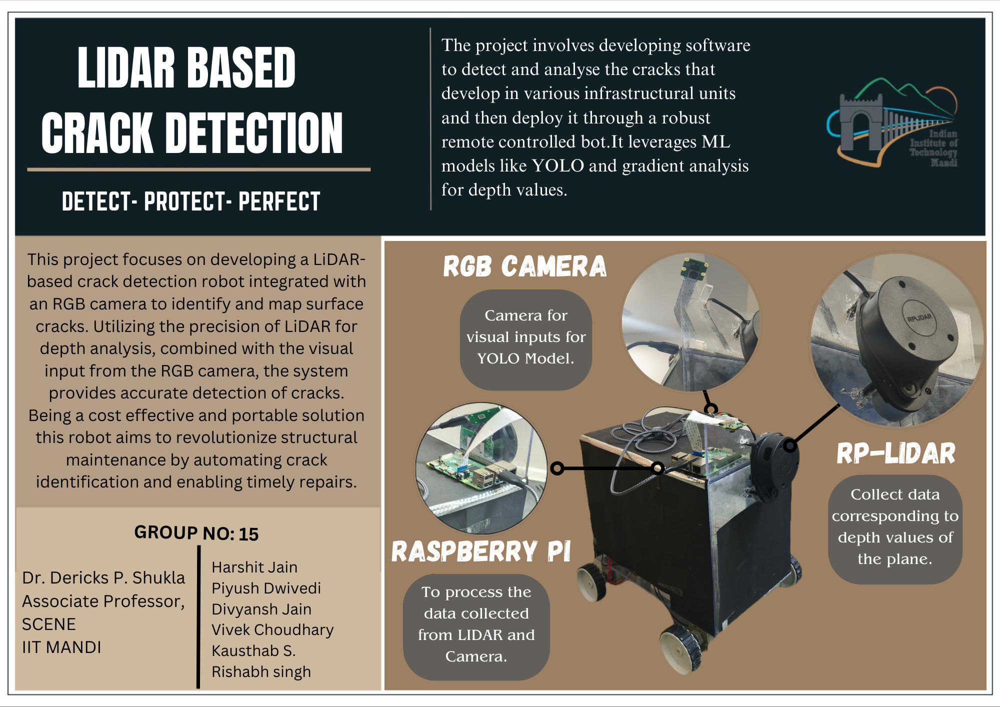

# LiDAR-Based-CrackDetection

A sophisticated crack detection system that combines LiDAR scanning with computer vision using YOLOv8 for accurate identification of natural cracks. The system integrates data from both LiDAR and RGB camera inputs to provide comprehensive crack detection capabilities.

## Hardware Requirements

- Raspberry Pi 4 Model B (minimum 4GB RAM)
- Raspberry Pi Camera Module 3
- SLAMTEC RPLiDAR A1M8 360 Degree Laser Range Finder (6m range)

## Software Requirements

- Raspbian OS
- Python 3.x
- YOLOv8
- Additional dependencies (listed in `requirements.txt`)

## Project Structure

```
LiDAR-Based-CrackDetection/
├── integrate/           # Main implementation files
│   ├── detect.py       # Core detection logic
│   ├── lidar.py        # LiDAR processing
│   └── ...
├── tuning/             
│   └── tuning.zip      # Dataset for YOLOv8 model training
└── README.md
```

## Quick Start

1. Clone the repository:
```bash
git clone https://github.com/yourusername/LiDAR-Based-CrackDetection.git
cd LiDAR-Based-CrackDetection
```

2. Install dependencies:
```bash
pip install -r requirements.txt
```

3. Connect hardware:
   - Connect the Raspberry Pi Camera Module 3 to the camera port
   - Connect the RPLiDAR A1M8 to a USB port
   - Ensure proper power supply to all components

4. Run the detection system:
```bash
cd integrate
python main.py
```

## Custom Model Training

If you wish to train the YOLOv8 model on your own dataset:

1. Extract the training dataset:
```bash
cd tuning
unzip tuning.zip
```

2. Follow the training instructions in `tuning/README.md`

## Implementation Details

The system operates by:
1. Capturing RGB images through the Raspberry Pi camera
2. Collecting LiDAR scan data for depth information
3. Processing both inputs through the YOLOv8 model
4. Combining the results for accurate crack detection

## Troubleshooting

Common issues and their solutions:
- Ensure LiDAR sensor has appropriate permissions (`sudo chmod 666 /dev/ttyUSB0`)
- Verify camera module is properly enabled in raspi-config
- Check system has sufficient RAM available for model inference

## Contributing

Contributions are welcome! Please feel free to submit a Pull Request.

## License

This project is licensed under the MIT License - see the LICENSE file for details.

## Acknowledgments

- SLAMTEC for the RPLiDAR A1M8
- Ultralytics for YOLOv8
- Raspberry Pi Foundation

## Contact

For questions or feedback, please open an issue in the repository.

---
**Note**: All necessary files to run the project locally are included in the `integrate` directory. For model training, use the dataset provided in `tuning/tuning.zip`.
